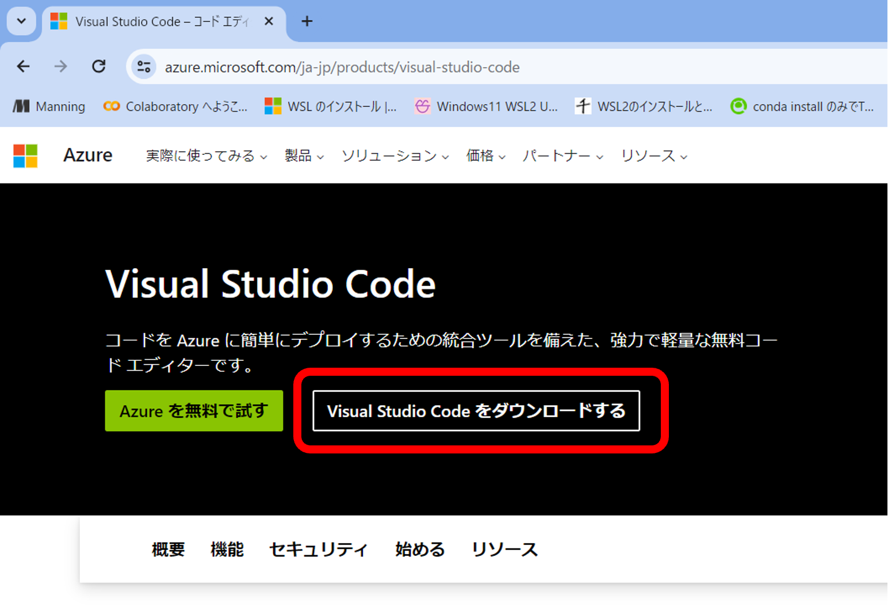
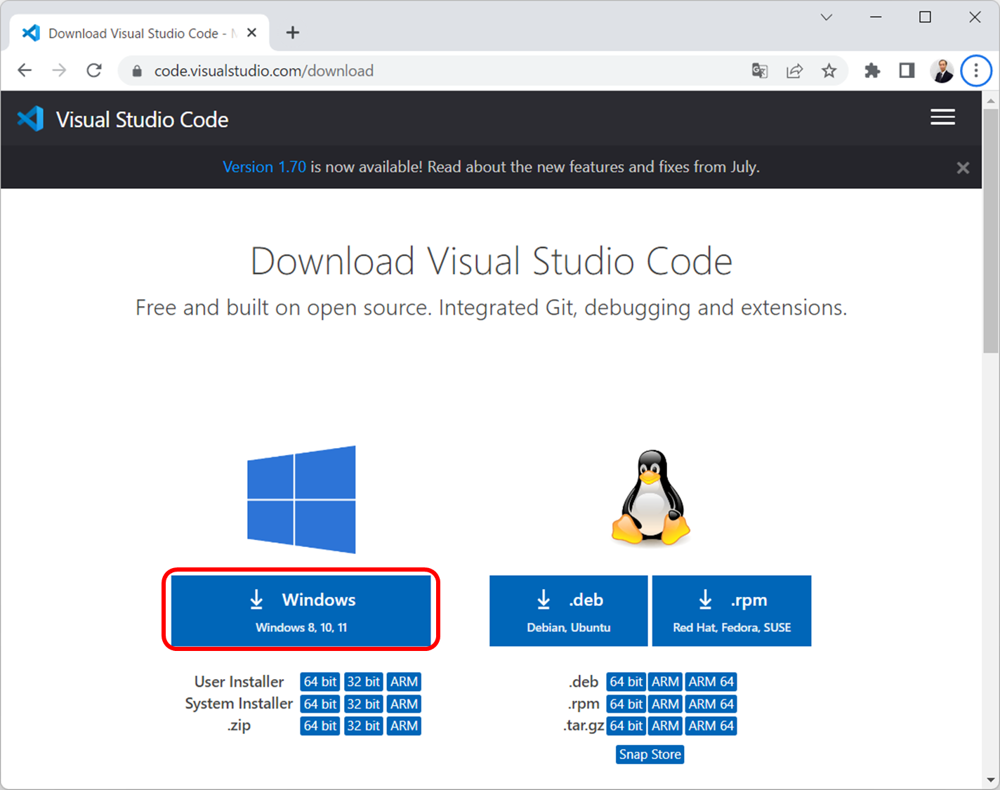
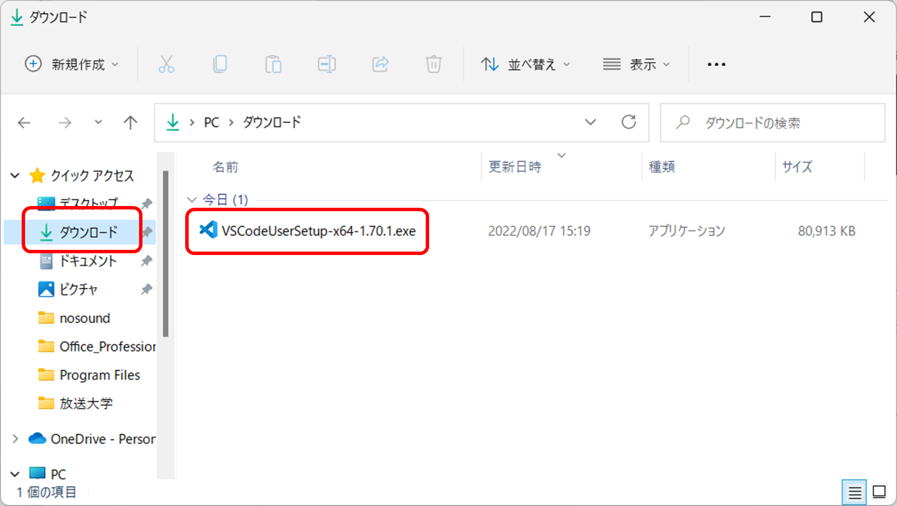
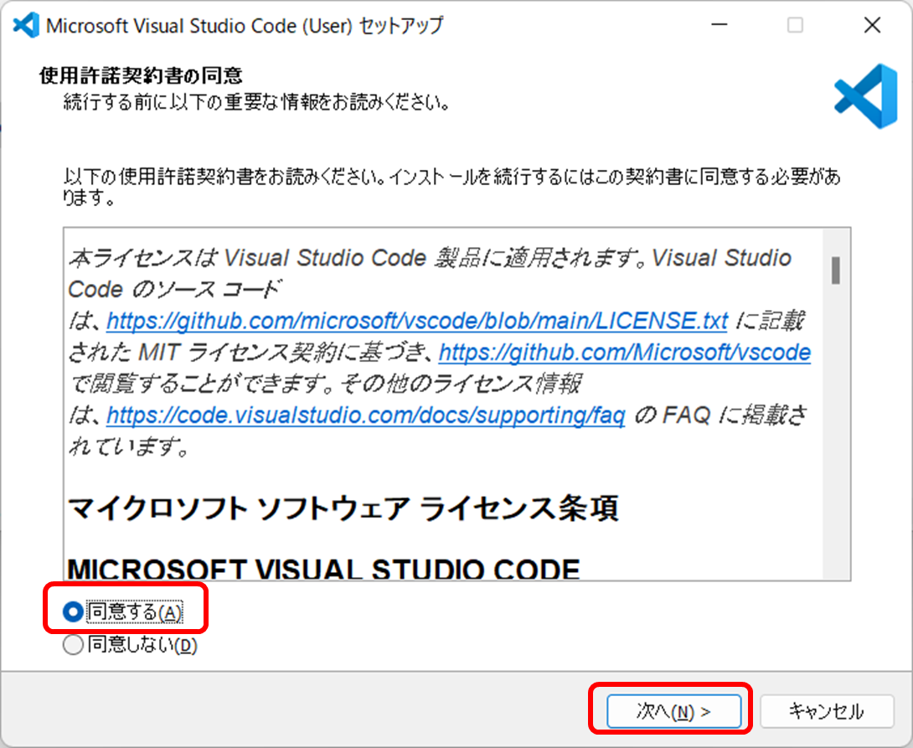
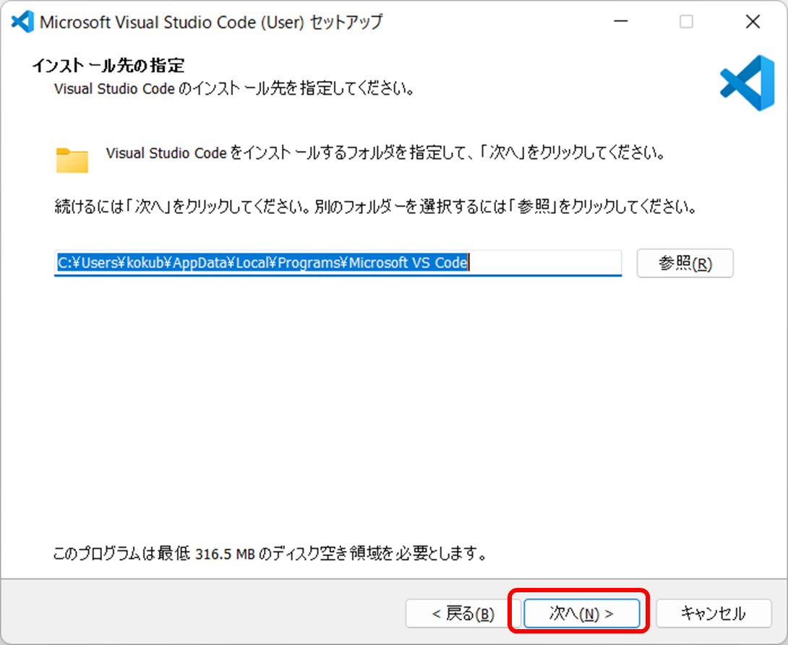
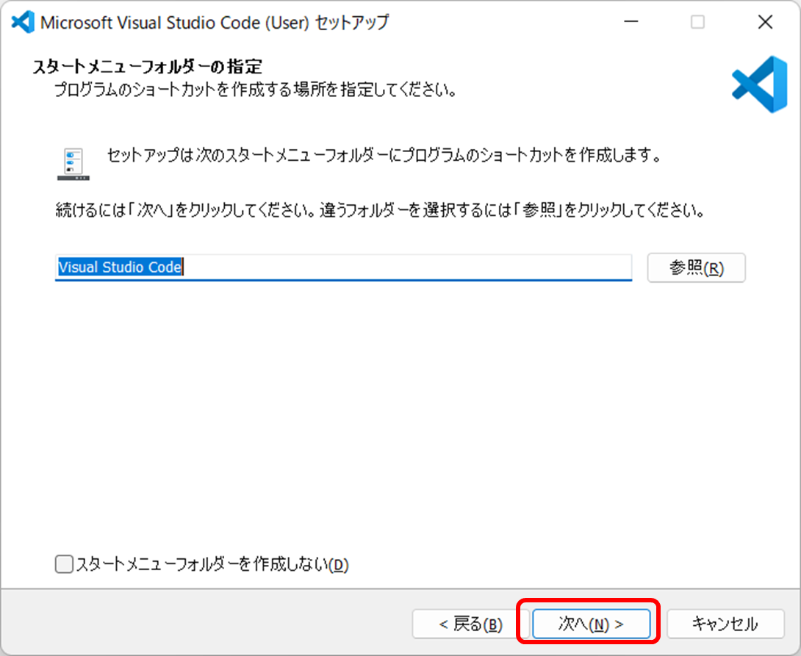
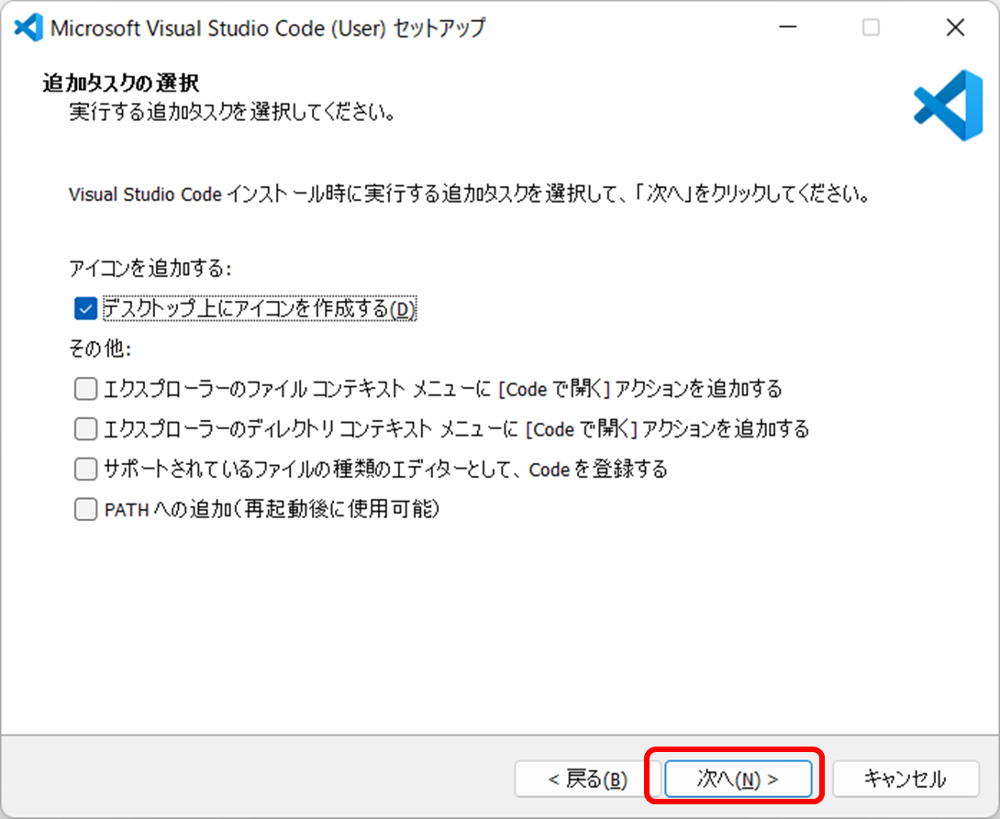
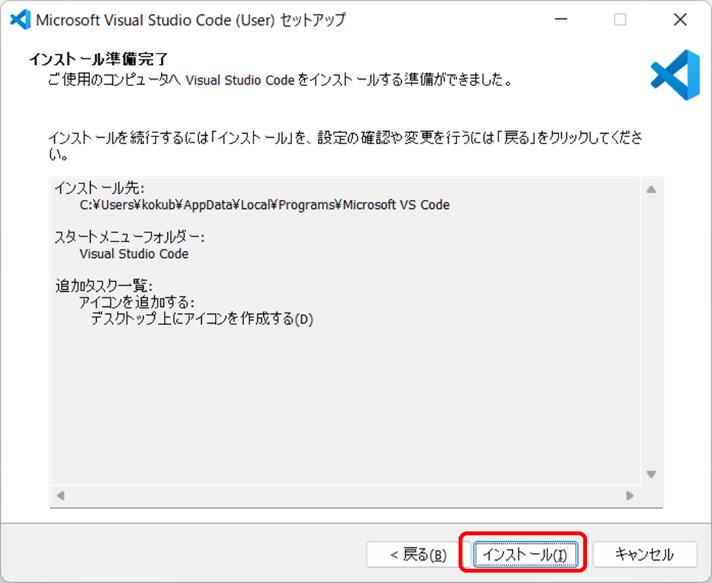
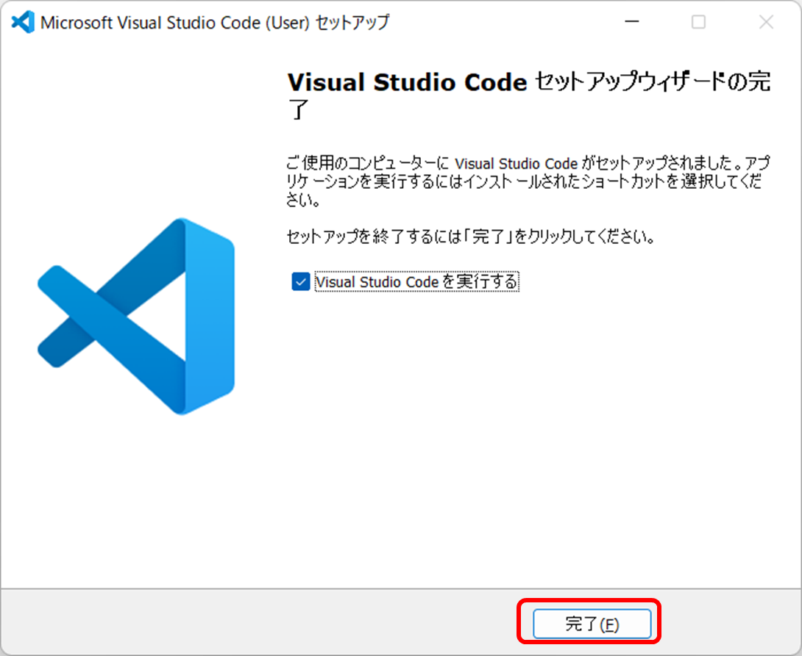

# ​​Visual Studio Codeのインストール

## 1. ブラウザを起動する

## 2. 「visual studio code」で検索する。

## 3. 検索結果から公式サイトの「Visual Studio Code - コードエディター...」を選ぶ

## 4. 公式サイトで「Visual Studio Codeをダウンロードする」を選ぶ

# 

## 5. Windows版を選ぶ

## 6. 「ダウンロード」フォルダにダウンロードされる

「VSCodeUserSetup....exe」のような名前のファイルになる。

## 7. ファイルをダブルクリックしてインストール

## 8. アプリがデバイスに変更を加える許可を求められたら

もしも「このアプリがデバイスに変更を加えることを許可しますか？」と聞かれたら「はい」。
なお、信用できないアプリの場合は「いいえ」。

※出ないかもしれない

## 9. 使用許諾契約書に「同意する」を選んで「次へ」

## 10. 「次へ」

## 11. 「次へ」

## 12. 「デスクトップ上にアイコンを作成する」など、必要と思えるものにチェックを入れ「次へ」

## 13. 「インストール」

## 14. 「完了」

## 15. Visual Studio Codeが起動する
