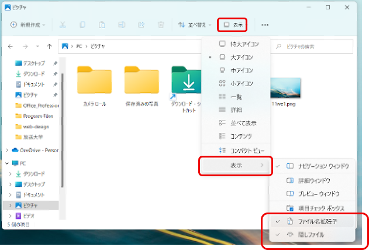

# 拡張子を表示させる設定

## 拡張子とは
拡張子とは、ファイル名の末尾の部分である。
たとえば「.jpg」「.pdf」「.docx」など。

Windowsではファイルの種類を拡張子で識別している。
しかし、**デフォルトでは表示されない**ようになっている。
デフォルトとは、自分で設定をいじっていない状態のことである。

### 拡張子が表示されていない状態

※何も設定していないとこうなる

### 拡張子が表示されている状態

## 拡張子を表示させる設定

拡張子を表示させないと、いろいろトラブルが起きやすいので、表示するように設定する。

### 1.エクスプローラーを起動

### 2.「表示」→「表示」→「ファイル名拡張子」にチェック

※「隠しファイル」にもチェックを入れてもいい。
